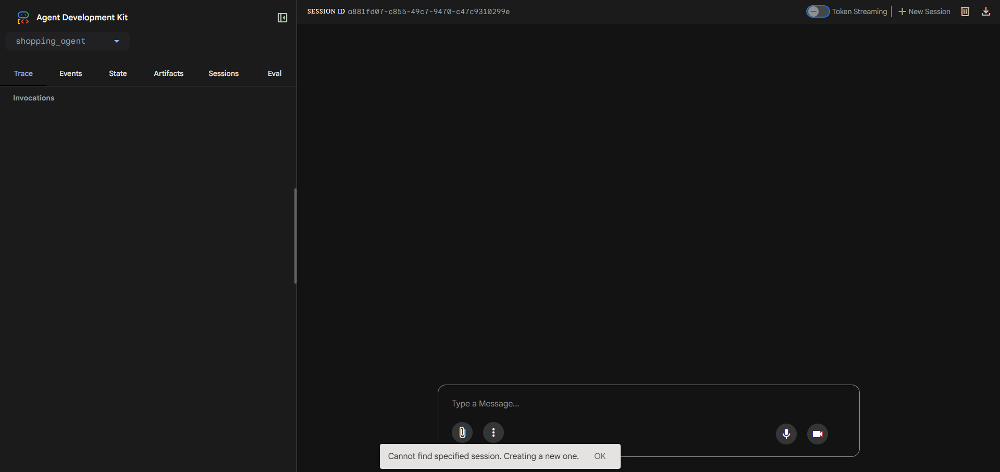
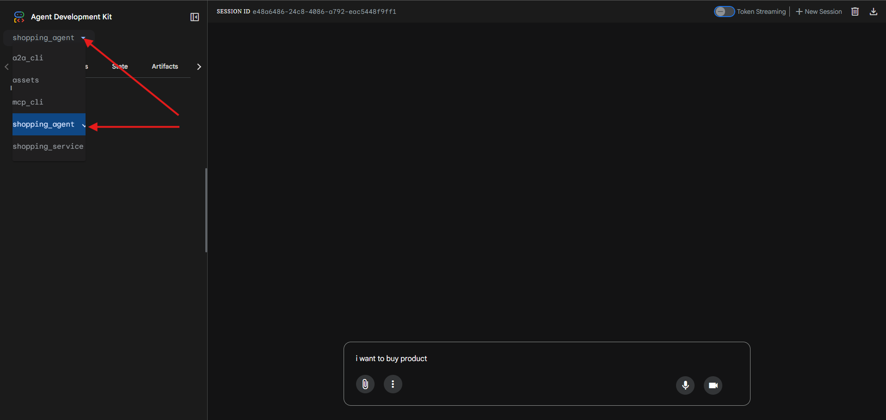
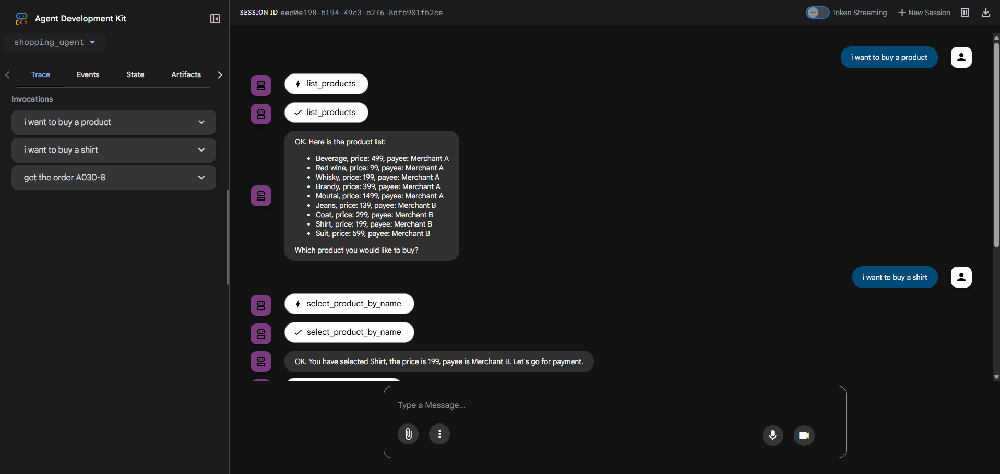
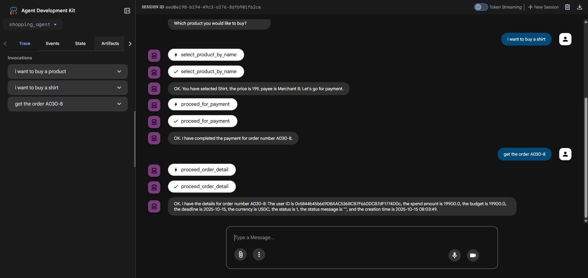

# Shopping Agent Console Demo Guide

## Project Overview

Shopping Agent is an intelligent shopping assistant system built on Google ADK (Agent Development Kit). This project demonstrates how to integrate multiple services together, including A2A (Agent-to-Agent) communication, MCP (Model Context Protocol) client, and FastAPI services, to create a complete shopping and payment workflow.

## System Architecture

The project contains the following main components:

1. **Shopping Agent** (`shopping_agent/agent.py`) - The main intelligent shopping assistant
2. **A2A CLI** (`a2a_cli/cli.py`) - Agent-to-Agent communication client
3. **MCP CLI** (`mcp_cli/cli.py`) - Model Context Protocol client
4. **Shopping Service** (`shopping_service/server.py`) - Backend service API

## Prerequisites

- Python 3.13+
- UV package manager
- Running A2A server (Default - http://localhost:10000)
- Running MCP server (Default - host: localhost, port: 8015)

## Quick Start

### 1. Environment Setup

This section guides you through initializing your development environment, including project cloning, virtual environment creation and activation, and dependency installation.

#### 1.1 Clone the Repository

```bash
git clone https://github.com/Zen7-Labs/Zen7-Console-Demo.git
```

#### 1.2 Enter the Project Directory

```bash
cd Zen7-Console-Demo
```

#### 1.3 Create and Activate a Virtual Environment (Recommended)

1. Create the virtual environment:

```bash
uv venv
```

1. Activate the virtual environment:

- **Linux/macOS:**
   ```bash
   source .venv/bin/activate
   ```
- **Windows (CMD):**
   ```bash
   .venv\Scripts\activate
   ```
- **Windows (PowerShell):**
   ```powershell
   .venv\Scripts\Activate.ps1
   ```

> After activation, your command prompt should show (venv) at the beginning.

#### 1.4 Install Dependencies

```bash
(venv) $ uv sync
```

### 2. Configure Environment Variables

Create a `.env` file in the project root directory with the following content (fill in your actual keys and service addresses):

```dotenv
# Google API Key
GOOGLE_API_KEY=<your_google_api_key_here>

# Choose target server to connect with specified A2A or MCP client.
TARGET_SERVER=a2a

# A2A Service Configuration
A2A_SERVER_URL=http://localhost:10000

# MCP Service Configuration
MCP_HOST=127.0.0.1
MCP_PORT=8015

# Provide shopping_service URL to check or reset status to assist proceeding payment and settlement decide whether it has finished.
CHECK_STATUS_URL=http://localhost:8088/status
RESET_STATUS_URL=http://localhost:8088/reset
```

> For blockchain or payment integration, refer to the relevant documentation to add more environment variables as needed.

### 3. Start Services

#### 3.1 Start the Shopping Service (Status check API)
- Provide service to check or reset status to assist proceeding payment and settlement decide whether it has finished in multi turns of conversation.

```bash
(venv) $ uv run python shopping_service/server.py
```

#### 3.2 Start the Main Application (Google ADK Web UI)
- Make sure you current at the path `Zen7-Console-Demo`

```bash
(venv) $ uv run adk web
```

Or run the script directly:

- **Linux/macOS:**
    ```bash
    ./run.sh
    ```
- **Windows:**
    ```powershell
    uv run adk web
    ```

> For custom IP, ports and other parameters, change them in the `.env` file.

## 5. Usage Guide

### 5.1 The main flow

1. **List Products**: Ask the assistant that I want want to buy a product.
2. **Select Product**: Choose a product to purchase by name.
3. **Payment Process**: The assistant will automatical start the payment and settlement by your chosen product with its price and merchant info.
4. **Order Tracking**: When the settlement has been processed, the assistant will notify the payee and return the order number in messages, you can retrieve the order info by using this order number

### 5.2 Example Conversation
1. Open your browser and visit for URL `http://localhost:8000`

2. Make sure you have chosen the `shopping_agent`.

3. Chat with assistant to start buying a product

4. Wait settlement to completed then get order by the order number.


## 6. Troubleshooting

**Q: My server is stuck**

A: You need to make sure your system can visit `https://google.com`.

**Q: How can I confirm which type of service was chosen?**

A: Check the `.env` file for the option `TARGET_SERVER=a2a` decide the chosen type of service.

**Q: A2A service connection failed?**

A: Make sure the A2A service is running on local port 10000 and check network connectivity.

**Q: MCP service connection failed?**

A: Make sure the MCP service is running on local port 8015 and the SSE endpoint is accessible.

**Q: Google ADK initialization failed?**

A: Check if the `GOOGLE_API_KEY` environment variable is set correctly.

**Q: Product selection not responding?**

A: Make sure the product name is entered correctly. The system supports fuzzy (case-insensitive) matching.

## Technology Stack

- Python 3.13+
- Google ADK
- FastAPI
- A2A SDK
- MCP
- uv
- HTTPX

## Citation

If you find Zen7 Payment Agent helpful in your research or project, please cite it as:

```bibtex
@misc{zen7paymentagent,
  author = {Zen7 Labs},
  title = {Zen7 Payment Agent: AI-Powered Blockchain Payment Service},
  year = {2025},
  publisher = {GitHub},
  url = {https://github.com/Zen7-Labs/Zen7-Payment-Agent}
}
```

## License

Apache License Version 2.0

